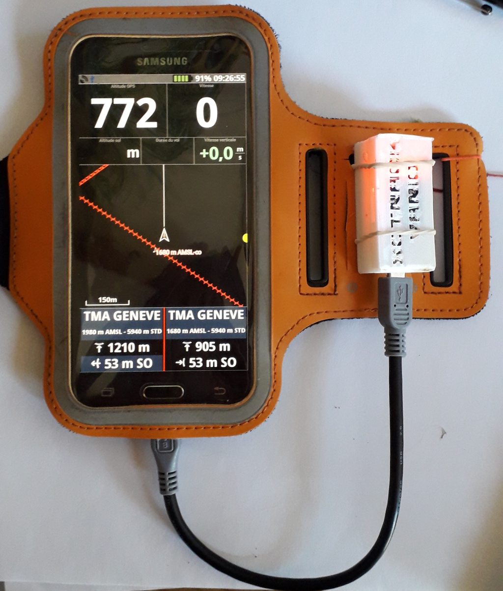
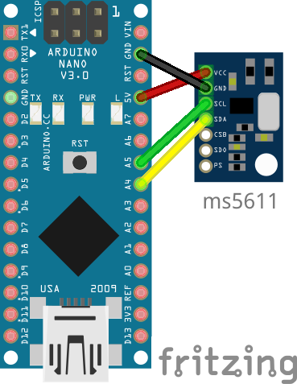
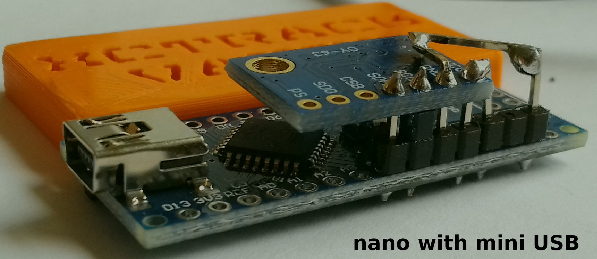
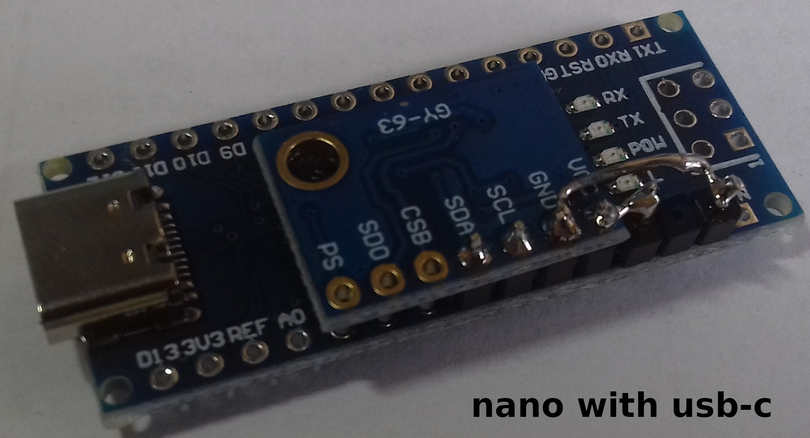
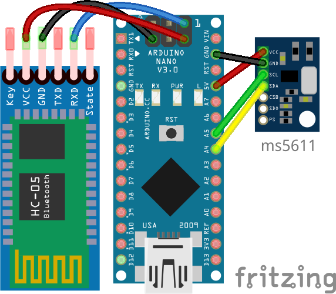
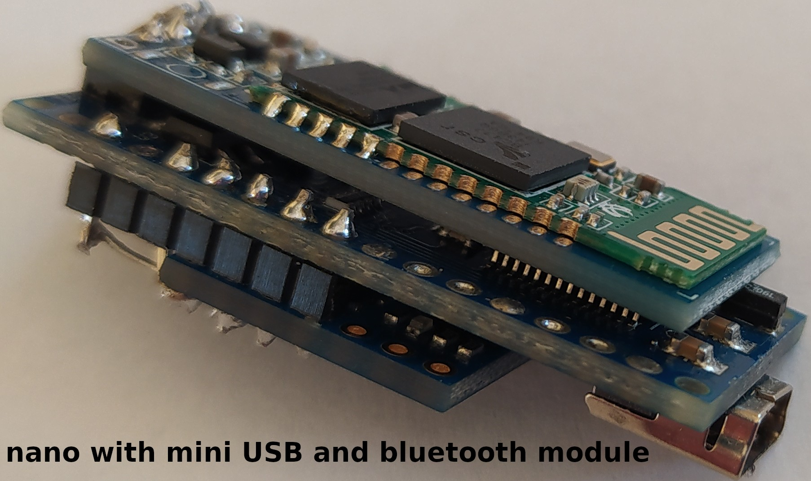
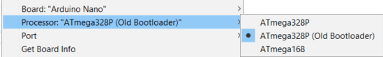

# XCTRACK_vario DO IT YOURSELF !

## Table of Contents

- [Overview](#overview)
- [Components](#components)
- [Step by step](#step-by-step)
- [Diagrams](#diagrams)
    * [USB support only](#usb-support-only)
    * [USB and bluetooth support](#usb-and-bluetooth-support)
- [Known issues](#known-issues)
  
## Overview 

Variometer for [XCTRACK](https://xctrack.org/) based on MS5611 high precision pressure and temperature sensor and LK8000.

It works via USB or Bluetooth on XCtrack!

Power consumption ~0.1W (a little bit more with bluetooth)

Based on Arduino Vario by Benjamin PERRIN 2017 / Vari'Up
Based on Arduino Vario by Jaros, 2012 and vario DFelix 2013
https://github.com/LK8000/LK8000/blob/master/Docs/LK8EX1.txt

### Components
- Arduino Nano with FTDI chip (or ch340g chip since xctrack 0.9.3)
- MS5611 pressure and temperature sensor
- bluetooth module in option (hc-05 or hc-06 or cpp module (ZS-040))
- USB mini/micro/type c OTG cable (if USB mode), depends on your phone
<a href="https://my.aliexpress.com/wishlist/shared.htm?groupId=100000009108834" target="_blank">aliexpress</a>
- PLA box 3D printing
<a href="https://cad.onshape.com/documents/8ec970df0f91cd7f4dafb0b8/w/81f5e80ab2d84901aa8e29be/e/2df0103f0eb100d6330b3609" target="_blank">Onshape</a>
  


## Step by step

1) Download MS5XXX library by Roman Schmitz. (Go to Tools, Manage Libraries and search for "MS5xxx"; install the library done by  Roman Schmitz.)

1) If you want to use it as only usb, just upload the code in (XCTRACK_VARIO_MS5611/XCTRACK_VARIO_MS5611.ino).

To use it as bluetooth (and USB), simply change the following code

```
#define USB_MODE // usb by default
// #define BLUETOOTH_MODE // uncomment this line for bluetooth mode
```

to

```
#define USB_MODE // usb by default
#define BLUETOOTH_MODE // uncomment this line for bluetooth mode
```

Note: To build this vario, you *may* be able to use other Arduinos besides the nano: simply connect the SCL/SDA of the MS5611 to the respective SCL/SDA ports of your Arduino.

## Diagrams

### USB support only







### USB and bluetooth support






### Known issues

#### The arduino seems bricked
You may have connected the SCL/SDA ports wrong. 

If you can't upload to your arduino:

1) Disconnect it from the computer 
   
1) Press and hold the reset button

1) Plug it back (don't release the reset)
   
1) Click upload (don't release the reset)
   
1) When the IDE says that is uploading (after compiling ends) release the reset button

#### Can't upload
Assuming you are using a nano, you may have an older bootloader version. 

Change the processor to "ATmega328P (Old Bootloader)" 


